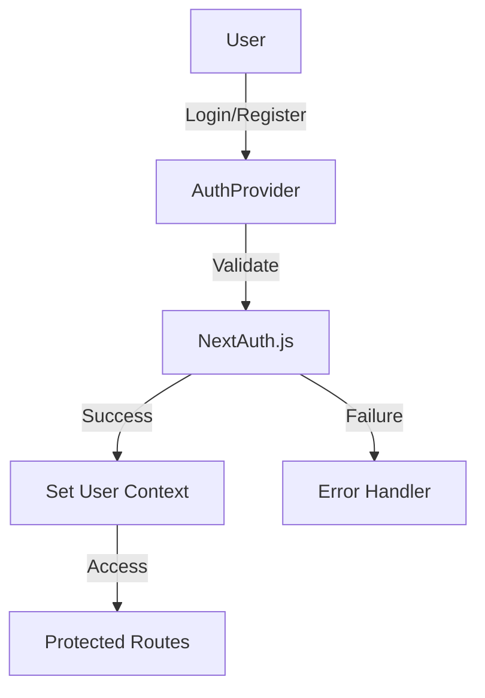
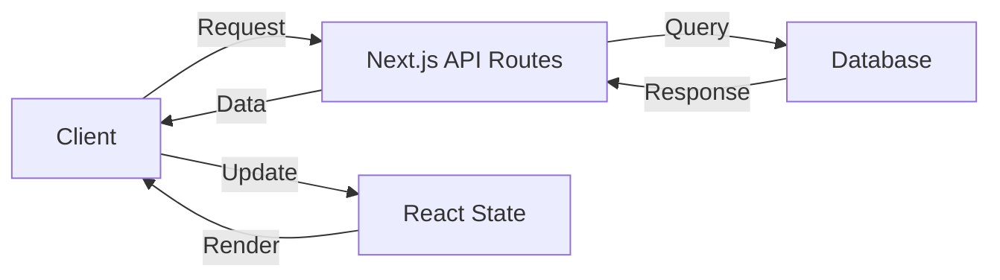
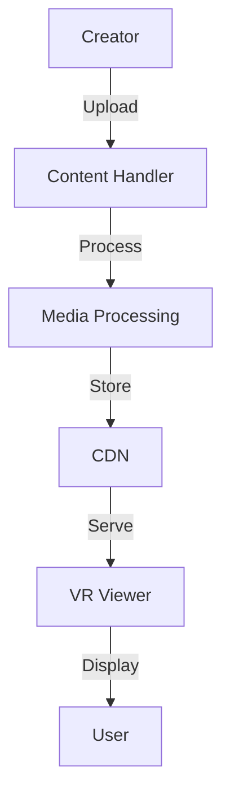
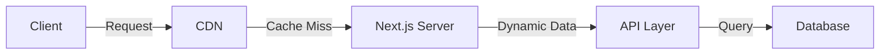

# Technical Architecture

## 🏗 System Overview

### Frontend Architecture
```
PrimePlus+ Frontend
├── Next.js 14 (App Router)
├── TypeScript
├── Tailwind CSS
└── Component Libraries
    ├── A-Frame (VR)
    ├── Framer Motion
    └── Heroicons
```

## 🔑 Authentication Flow


## 📁 Directory Structure Details
```
frontend/src/
├── app/                    # Next.js 14 app directory
│   ├── api/               # API routes
│   │   ├── auth/         # Authentication endpoints
│   │   ├── posts/        # Content management
│   │   └── vr/          # VR content handling
│   ├── (auth)/          # Authentication pages
│   ├── (dashboard)/     # User dashboard
│   └── vr/              # VR content pages
├── components/
│   ├── auth/            # Authentication components
│   ├── layouts/         # Layout components
│   ├── providers/       # Context providers
│   ├── ui/             # Shared UI components
│   └── vr/             # VR-specific components
├── lib/
│   ├── api/            # API utilities
│   ├── auth/           # Auth utilities
│   ├── db/             # Database utilities
│   └── utils/          # General utilities
└── types/              # TypeScript definitions
```

## 🔄 Data Flow


## 🎮 VR System Architecture

### Components
```
VR System
├── VRViewer
│   ├── A-Frame Scene
│   ├── Controls
│   └── Asset Management
├── Content Types
│   ├── 3D Models
│   ├── 360° Videos
│   └── 360° Images
└── Features
    ├── Interaction Handlers
    ├── Loading States
    └── Error Handling
```

### Content Flow


## 💾 Database Schema

### User Model
```prisma
model User {
  id        String   @id @default(cuid())
  email     String   @unique
  name      String?
  role      Role     @default(USER)
  content   Content[]
  createdAt DateTime @default(now())
  updatedAt DateTime @updatedAt
}

enum Role {
  USER
  CREATOR
  ADMIN
}
```

### Content Model
```prisma
model Content {
  id          String   @id @default(cuid())
  title       String
  description String?
  type        ContentType
  url         String
  isPremium   Boolean  @default(false)
  price       Float?
  authorId    String
  author      User     @relation(fields: [authorId], references: [id])
  createdAt   DateTime @default(now())
  updatedAt   DateTime @updatedAt
}

enum ContentType {
  MODEL_3D
  VIDEO_360
  IMAGE_360
}
```

## 🔒 Security Implementation

### Authentication
- NextAuth.js for authentication
- JWT tokens for API requests
- Role-based access control
- Protected API routes

### Data Protection
- Input validation
- XSS prevention
- CSRF protection
- Rate limiting

## 📈 Performance Optimization

### Frontend
- Static page generation
- Image optimization
- Code splitting
- Lazy loading

### VR Content
- Progressive loading
- Quality scaling
- Caching strategy
- CDN integration

## 🔄 State Management

### Global State
- Authentication state
- User preferences
- Theme settings

### Local State
- Form data
- UI interactions
- Component state

## 🧪 Testing Strategy

### Unit Tests
- Components
- Utilities
- Hooks

### Integration Tests
- API routes
- Authentication flow
- Content management

### E2E Tests
- User journeys
- Critical paths
- VR interactions

## 📱 Responsive Design

### Breakpoints
```css
sm: 640px   // Mobile landscape
md: 768px   // Tablets
lg: 1024px  // Desktop
xl: 1280px  // Large desktop
2xl: 1536px // Extra large screens
```

### Layout Patterns
- Mobile-first approach
- Fluid typography
- Responsive containers
- Adaptive layouts

## 🚀 Deployment Architecture

### Production Setup


### Infrastructure
- Vercel deployment
- PostgreSQL database
- CDN for media
- Monitoring services 